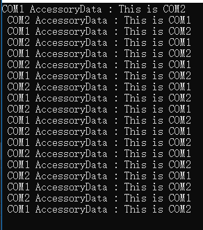
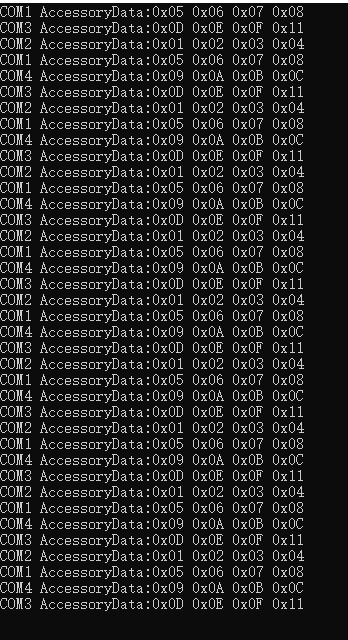
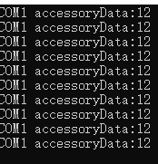

# RS232DLL
##  Version 2.0
### Quick to Start

COM1&Com2 is the pair of SerialPort. 

```
  ISerialPort COM1 = RS232Helper.Create("COM1", "COM1 AccessoryData", (str, obj) =>
    {
        Console.Write($"{obj as string} : {str as string} \r\n ");
    });
  ISerialPort COM2 = RS232Helper.Create("COM2", "COM2 AccessoryData", (str, obj) =>
  {
      Console.Write($"{obj as string} : {str as string} \r\n ");
  });
  for (int i = 0; i < 10; i++)
  {
      COM1.WriteStr("This is COM1");
      Thread.Sleep(500);
      COM2.WriteStr("This is COM2");
      Thread.Sleep(500);
  }
  Console.Read();
  COM1.Dispose();
  COM2.Dispose();
```

Result:



### SerialPort Group

pair of SerialPort:COM1&COM2,COM3&COM4

```
  List<SPInstanceBase> SPIs = new List<SPInstanceBase>()
  {
      new SPInstanceBase("COM1","COM1 AccessoryData",delegate(Hex hex,object obj){Console.WriteLine((obj as string)+":"+hex.hexstring); }),
      new SPInstanceBase("COM2","COM2 AccessoryData",delegate(Hex hex,object obj){Console.WriteLine((obj as string)+":"+hex.hexstring); }),
      new SPInstanceBase("COM3","COM3 AccessoryData",delegate(Hex hex,object obj){Console.WriteLine((obj as string)+":"+hex.hexstring); }),
      new SPInstanceBase("COM4","COM4 AccessoryData",delegate(Hex hex,object obj){Console.WriteLine((obj as string)+":"+hex.hexstring); }),

  };
  for (int i = 0; i < 10; i++)
  {
      SPIs[0].WriteHex("0x01 02 3 0x4".GetHexValue());
      Thread.Sleep(500);
      SPIs[1].WriteHex("0X05 06 7 0X8".GetHexValue());
      Thread.Sleep(500);
      SPIs[2].WriteHex("0x09 0A B 0xC".GetHexValue());
      Thread.Sleep(500);
      SPIs[3].WriteHex("0X0D 0E F 0x11".GetHexValue());
      Thread.Sleep(500);
  }
  Console.Read();
```
Result:



### Customize your own Class

pair of SerialPort:COM1&COM2

```
 public class MySpInstance : SPInstanceBase
    {
    // override virtual methods
    }
```
u can use your serialport class,like this

```
    using (MySpInstance COM2 = new MySpInstance("COM2"))
    {
        using (MySpInstance COM1 = new MySpInstance("COM1", "COM1 accessoryData"))
        {
            COM1.BytesReaderInitialize((byts, obj) =>
            {
                Console.WriteLine($"{obj as string}:{byts.Count()}");
            });

            for (int i = 0; i < 10; i++)
            {
                COM2.WriteStr("This is COM2");
                Thread.Sleep(200);
            }
            Console.Read();
        }
    }
```
Result:


